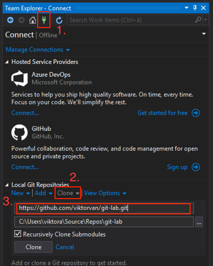

# Instructions

This is an example repository with some excercises to try as an introduction to git.

## Setup

#### 1. Start by cloning this repository

- Using the command line
    - Navigate to the parent folder where you want to place the source code.
    - Run the following command.
    ```
    git clone https://github.com/activesolution/introduction-to-git.git
    ```

- Using Visual Studio 2017
    - Open the Team Explorer
    -   1. Click 'Manage connections'
        2. Click 'Clone' under local git repositories
        3. Enter the repository address **https://github.com/activesolution/introduction-to-git.git**

    

#### 2. Open the solution and run it.

## Exercises
The exercises and their corresponding solutions can be found in the exercise folders.

## Useful links
### GUIs
- https://git-scm.com/downloads/guis/
- https://www.sourcetreeapp.com/
- https://desktop.github.com/
- https://gitextensions.github.io/
- https://git-fork.com/

### Cheat sheet
- https://education.github.com/git-cheat-sheet-education.pdf

### Tools
- [Generate .gitignore](https://gitignore.io/)
- [Git Credential Manager for Windows](https://github.com/Microsoft/Git-Credential-Manager-for-Windows)

### More learning
- [Learn git branching](https://learngitbranching.js.org/)
- [A visual git guide](https://marklodato.github.io/visual-git-guide/index-en.html)
- [Git as a graph](http://think-like-a-git.net/)
