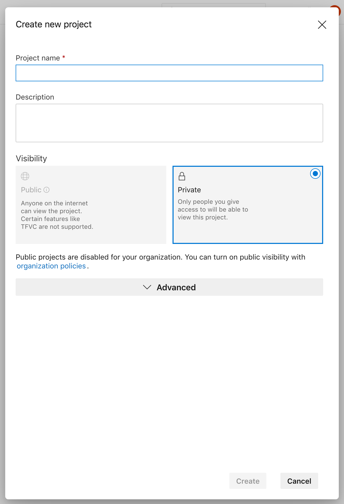
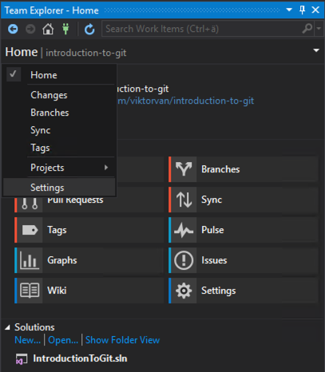
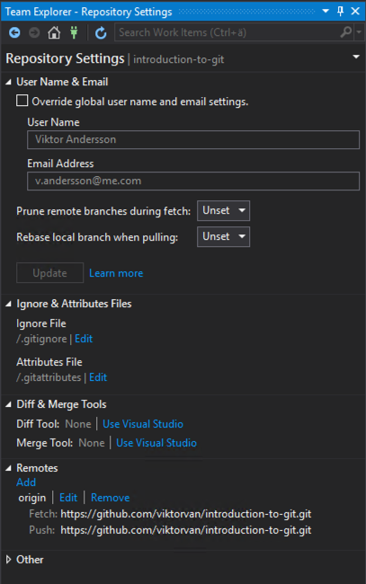

# Creating a new remote repository

1. Create your own git repository in Azure DevOps.
    - Go to Azure DevOps 
    - If you do not already have a suitable project, create a new one.

        


    - Go to **Repos** and copy the HTTPS url to your repository.

---

## using the command line

2. Update your local repository to use the new remote repository 
    ```
    git remote set-url origin <your-repo-url>
    ```
    verify that the correct url has been set
    ```
    git remote -v
    ```

3. `push` your local repository to the Azure repository.
    ```
    git push --set-upstream origin master
    ```

---

## using Visual Studio
2.
    - go to the **Team Explorer** and select settings from the top drop-down menu.  
          


    - select **Repository settings** and at the bottom edit the Remote url.  
        

3. `push` your local repository to the Azure repository.

---

4. Go to your repository in Azure DevOps and verify that repository is not empty.  
    \-