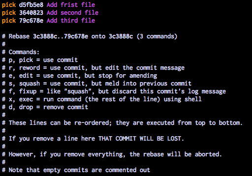
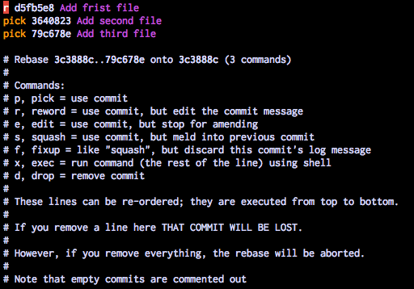
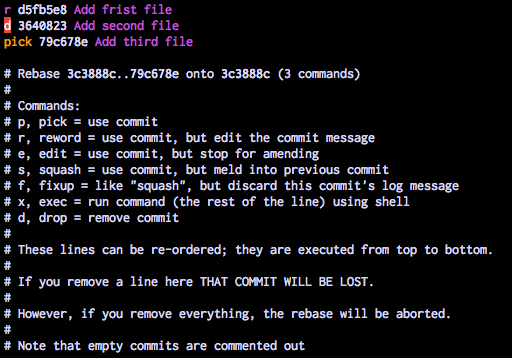
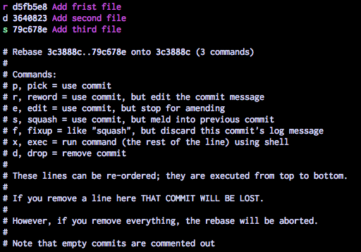
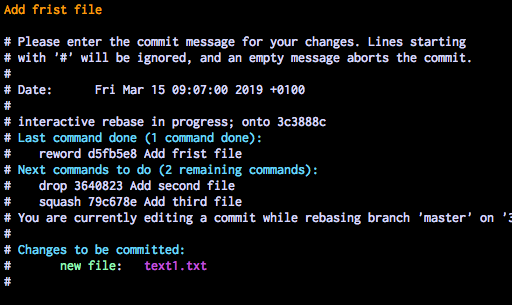
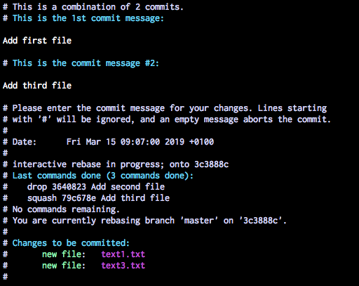

# Rewriting history completely

*Disclaimer: Rewriting history is usually not a good thing to do if the history is public, i.e. if you have pushed it to a remote repository.*

*Disclaimer2: If you have commited any secrets (passwords, api-keys etc.) and pushed them to a public remote repository, you should consider them leaked. Rewriting history at that point will not guarantee that they have not been compromised.* 

Using git's interactive `rebase` functionality you can essentially make any conceivable changes to your history, let's try it out.

1. Create a new feature `branch`.
    ```
    git checkout -b feature/exercise13
    ```

2. Make some changes to your code, for example add 3 files in 3 separate commits.
    ```
    git add text1.txt
    git commit -m"Add frist file"
    git add text2.txt
    git commit -m"Add second file"
    git add text3.txt
    git commit -m"Add third file"
    ```

3. ´rebase´ your changes interactively to changes to the history.
    First we can see that there is a typo in the first commit message, we want to fix that. Then we have realised that the second file should not have been added at all, so we will remove that commit. And finally we want to combine the remaining commits into just one commit.

    git's interactive rebase command takes as a parameter the number of commits we want to edit, in this case 3:
    ```
    git rebase -i HEAD~3
    ```
    Running this command will open up the default text editor that git is configured to use, it may look something like this:

    

    We can see in the descriptions what commands are available to us.
    First let's fix the typo by changing `pick` on the first line to `r` for reword.

    

    Then let's `d` for `drop` the second commit.

    

    Finally we want to merge the third commit into the first one using `s` for `squash`

    

    Now we save the file and exit the editor.

    A new editor will open, where we can `reword` the first commit message

    

    So we just correct the spelling error and save and exit the editor.

    Now a new editor opens again, this time prompting us to write the commit message for the to commits that we are squashing together:


    

    We can leave it as it is, and just save and exit the editor.
    
    Now git will update the commits for us as we specified and if we run `git log` we can see that we only have one commit, and that the typo has been fixed.