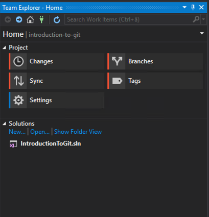
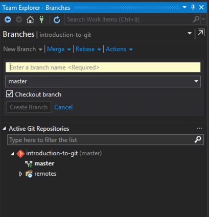
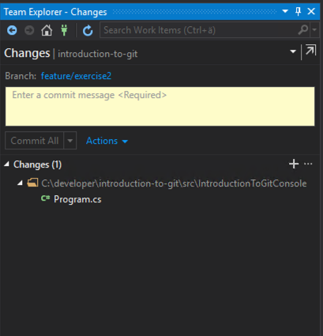
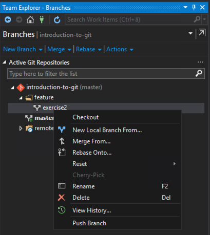
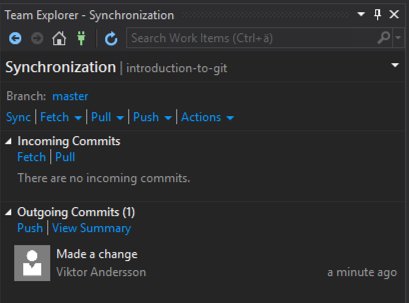

# Making changes

## Using the command line

1. Create a new feature `branch`.
    ```
    git checkout -b feature/exercise2
    ```

2. Make some changes to the code. For example, add a third paragraph in `Program.cs`.  
    \-

3. `commit` your changes.  
    There are several ways to `stage` your changes to the `index`.  
    1. Add all **modified** files to the index.
        ```
        git add --update
        ```
    2. Add all files, **modified** and **untracked** files.
        ```
        git add .
        ```
    3. Add files interactively using a menu with options.
        ```
        git add -i
        ```
    4. Add files selectively by `chunks`, selecting what chunk to commit and what to skip.
        ```
        git add -p
        ```


    Commit the files with a message.
    ```
    git commit -m"Added a paragraph"
    ```

4. `checkout` the `master` branch.
    ```
    git checkout master
    ```

5. `merge` your new branch into `master`.
    ```
    git merge feature/exercise2
    ```

6. `push` your changes.
    ```
    git push
    ```

7. Optionally delete your local feature `branch`.
    ```
    git branch -d feature/exercise2
    ```

8. Go to your Azure devops repository and verify that your changes have been pushed to the `master` branch.  
    \-


## Using Visual Studio

1. Create a new feature `branch`.
    - Go to the Teams Explorer and click `Branches`  
    
    - Then click New Branch and enter a name, for example feature/exercise2  
    

---

2. Make some changes to the code. For example, add a paragraph in `Program.cs`.  
    \-

3. `commit` your changes.
    - Go back to the Teams Explorer and click `Changes`
    - In the changes view you should see the changed file listed *Changes*  
    You can double-click the file to get to a `diff` view where you can see what has changed in the file.
    If you are happy with the changes you can right-click on the file and select `stage`. Or you can click the `+`-symbol next to Changes to stage all changed files.
    - Enter a commit message and press the `Commit Staged` button.  
    

---

4. `checkout` the `master` branch.
    - Go back to Branches in the Teams Explorer. Double-click on master or right-click and select `checkout`.

5. `merge` your new branch into `master`.
    - In the Branches view, right-click on your feature branch and select `Merge From...`  
    
    - Verify that you are merging from your feature branch to the master branch. Click `Merge` 

---

6. `push` your changes.
    - In the Team Explorer select the `Sync` view.  
    
    You can see that there is one outgoing change. Press `Push`.

---

7. Optionally delete your local feature `branch`.
    - Go back to the branches view, right-click on your feature branch and select delete.

8. Go to your Azure devops repository and verify that your changes have been pushed to the `master` branch.  
    \-