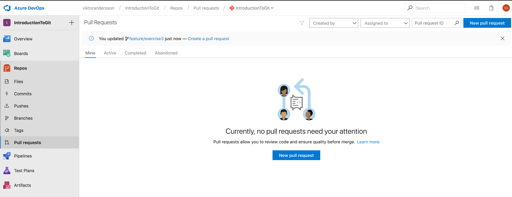
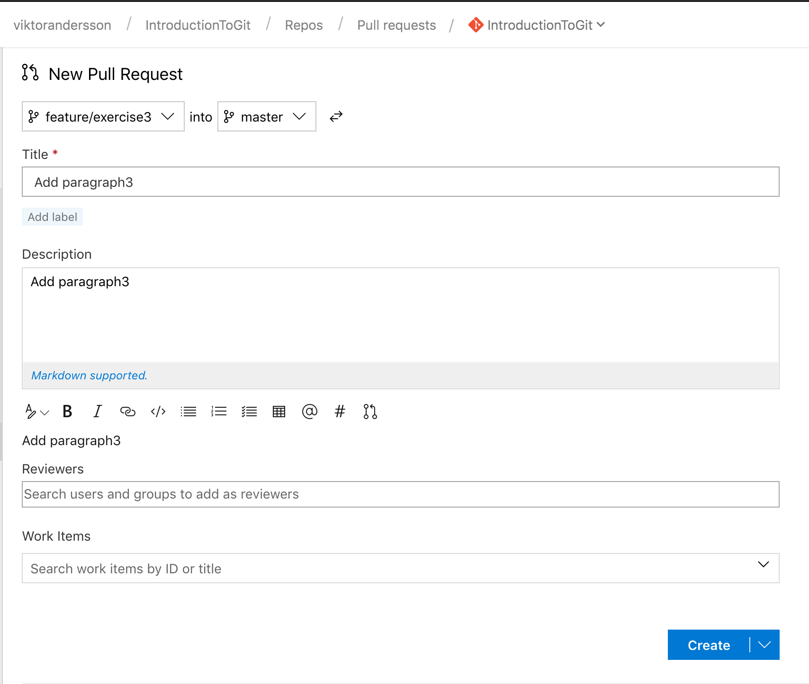
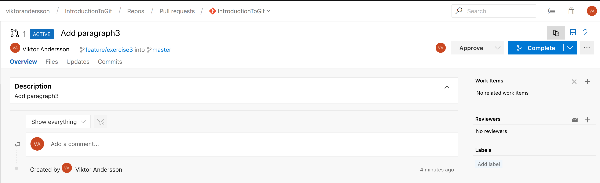

# Making a pull request

## Using the command line

1. Create a new feature `branch`.
    ```
    git checkout -b feature/exercise3
    ```

2. Make some changes to the code. For example, add another paragraph in `Program.cs`.  
    \-

3. `commit` your changes.
    ```
    git add --update
    git commit -m"Added a new paragraph"
    ```

4. `push` your feature branch.
    ```
    git push
    ```

5. Go to Azure DevOps and create a new `pull request` from your feature `branch`.
    - Go to Azure DevOps, select `Repos` -> `Pull requests`
    - Click `New pull request`  
    

    - Add a title and a description for the pull request and click `Create`.  
    

6. Approve and Complete the `pull request`, optionally delete the feature `branch` when prompted.
    

7. Go to your Azure DevOps repository and verify that your changes are now in the `master` branch.  
    \-

8. Go to your local repository and `pull` the latest changes from the `master` branch.
    ## Using the command line
    ```
    git checkout master
    git pull
    git branch -D feature/exercise3
    ```

    ## Using Visual Studio
    - Go to the Branches view in the Teams Explorer and checkout the master branch.
    - Go to the Sync view. If you cannot see any incoming changes, click Fetch.
    - You can push and pull all incoming and outgoing changes at once by pressing Sync, but I recommend you do it in steps.  
    Click Pull to get the incoming changes.  
    - Optionally go back to the Branches view and right-click and delete your feature branch.