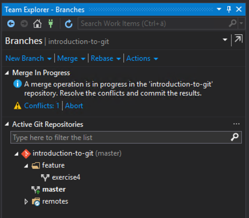
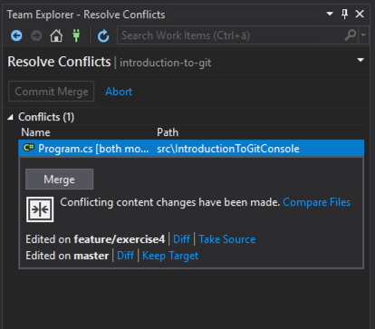
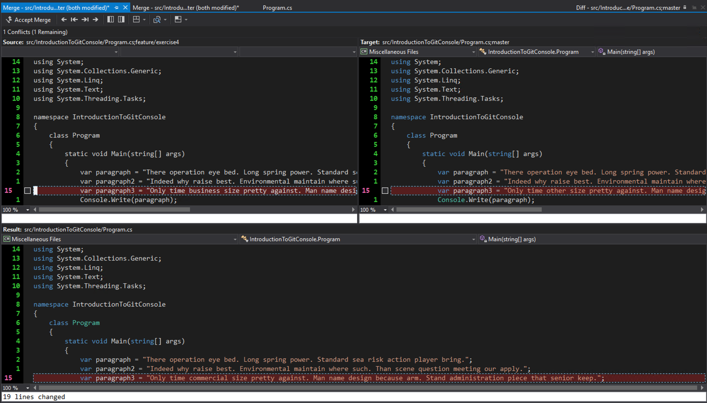

# Handling conflicts

## Using the command line

1. Create a new feature `branch`.
    ```
    git checkout -b feature/exercise4
    ```

2. Make some changes to the code. This time, make some changes to the contents of an existing paragraph.  
    \-

3. `commit` your changes.
    ```
    git add --update
    git commit -m"Updated a paragraph"
    ```

4. `checkout` the `master` branch.
    ```
    git checkout master
    ```

5. "Simulate" that someone else has made conflicting changes and pushed them to the `master` branch while we were working on our new feature.
    - Make new changes to the same paragraph that you changed in 2.  
        \-
    - Commit them in the `master` branch.
        ```
        git add --update
        git commit -m"Someone else made changes"
        ```

6. `merge` your new branch into `master`.
    ```
    git merge feature/exercise4
    ```

7. Oh no! Conflicts. Let's resolve them.
    ## Using the command line
    I recommend installing a third party tool to resolve conflicts, for example [kdiff3](http://kdiff3.sourceforge.net/) or [p4merge](https://www.perforce.com/products/helix-core-apps/merge-diff-tool-p4merge) and then configure your git GUI or git from the command line to use that tool for diffs and merges.

    After you have resolved the conflicts you have to commit the merge:
    ```
    git commit -m"Merge feature/exercise4 into master"
    ```

    ## Using visual studio
    When there are merge conflicts they will show up under the Branches view in the Teams Explorer. Click on conflicts to view the conflicts.  
    

    Click on the file you wish to handle conflicts for and press the Merge button to get to the merge view:  

    
    

    In the merge view select which change to keep (left or right) and select with the checkbox next to the changed line of code. Then click Accept Merge in the top of the merge view.
    In the Team Explorer you can then choose to commit the merge.

8. `push` your changes.
    ```
    git push
    ```

9. Go to your Azure DevOps repository and verify that your changes have been pushed to the `master` branch.  
    \-
