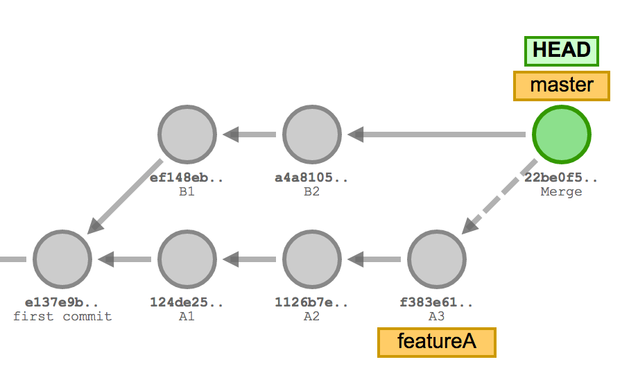
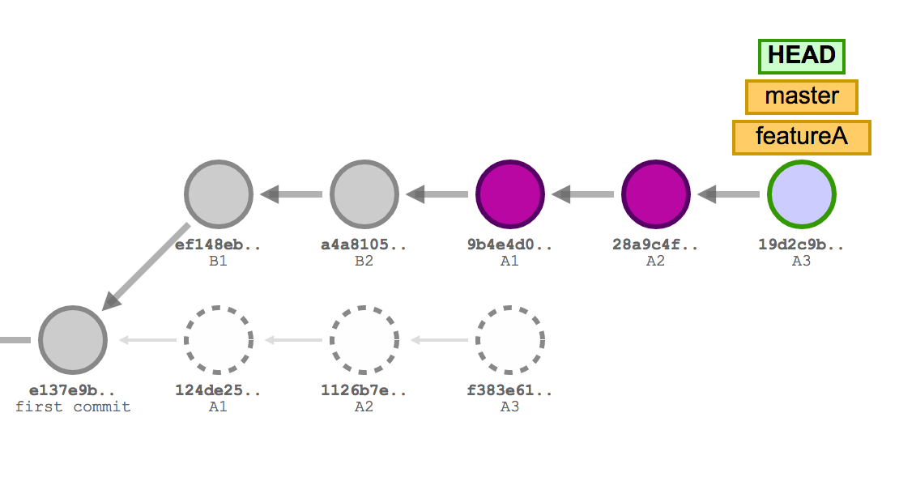

# Keep your history simple with `rebase`

When working on a `branch` there are two ways to merge your changes back to `master`.

If we have the following state.

We can `merge` like we did in exercise 2.
This will preserve the history of the separate branches, but will add an additional `merge commit`.

An alternative is to `rebase` which will take the commits from the feature branch and append them after the commits on `master`.

1. Create a new feature `branch`.

2. Make some changes to the code. 

3. `commit` your changes.

4. `rebase` your changes onto the `master` branch.

5. `checkout` the master `branch`.

6. `merge` your feature branch into master.
