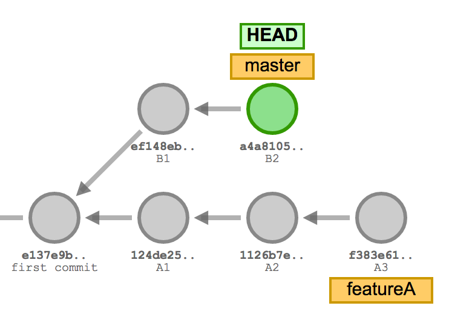
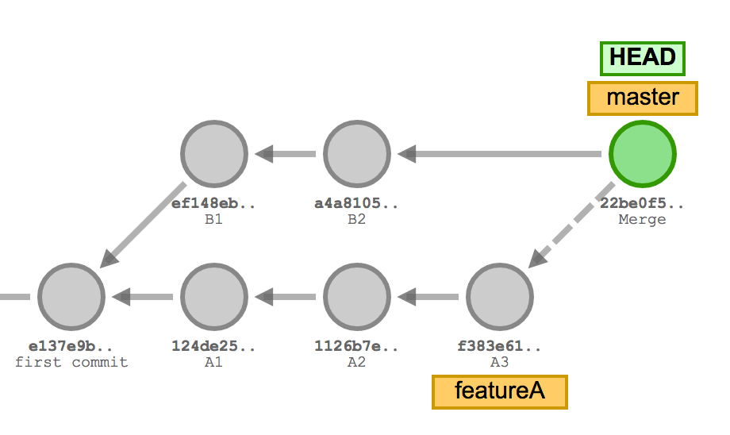
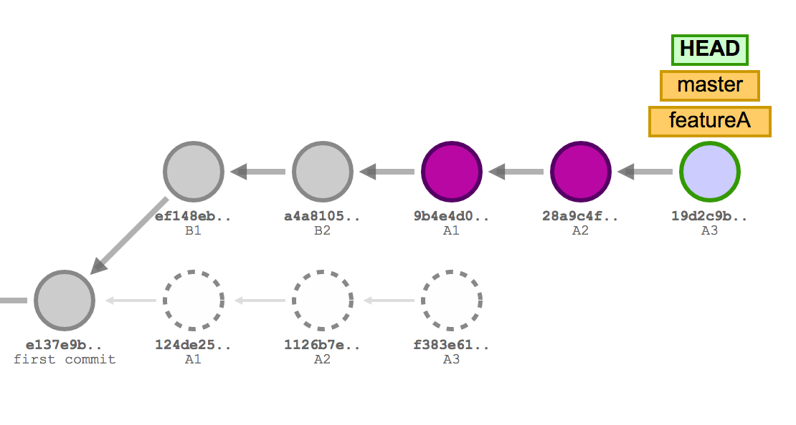

# Keep your history simple with `rebase`

When working on a `branch` there are two ways to merge your changes back to `master`.

If we have the following state.



We can `merge` like we did in exercise 2.
This will preserve the history of the separate branches, but will add an additional `merge commit`.



An alternative is to `rebase` which will take the commits from the feature branch and append them after the commits on `master`.



1. Create a new feature `branch`.
    ```
    git checkout -b feature/exercise6
    ```

2. Make some changes to the code. For exmple add a new file to avoid getting conflicts.  
    \-

3. `commit` your changes.
    ```
    git add .
    git commit -m"Making changes"
    ```

4. `checkout` the `master` branch.
    ```
    git checkout master
    ```

5. "Simulate" that someone else has made conflicting changes and pushed them to the `master` branch while we were working on our new feature.
    - Make new changes in other files to avoid getting conflicts.  
        \-
    - Commit them in the `master` branch.
        ```
        git add --update
        git commit -m"Someone else made changes"
        ```

6. `checkout` your feature branch.
    ```
    git checkout feature/exercise6
    ```

7. `rebase` your changes onto the `master` branch.
    ```
    git rebase master
    ```

8. `checkout` the master `branch`.
    ```
    git checkout master
    ```

9. `merge` your feature branch into master.

    ```
    git merge feature/exercise6
    git push
    git branch -d feature/exercise6
    ```