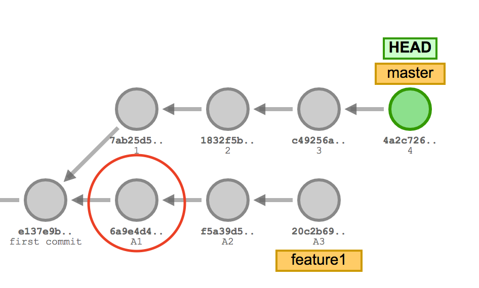
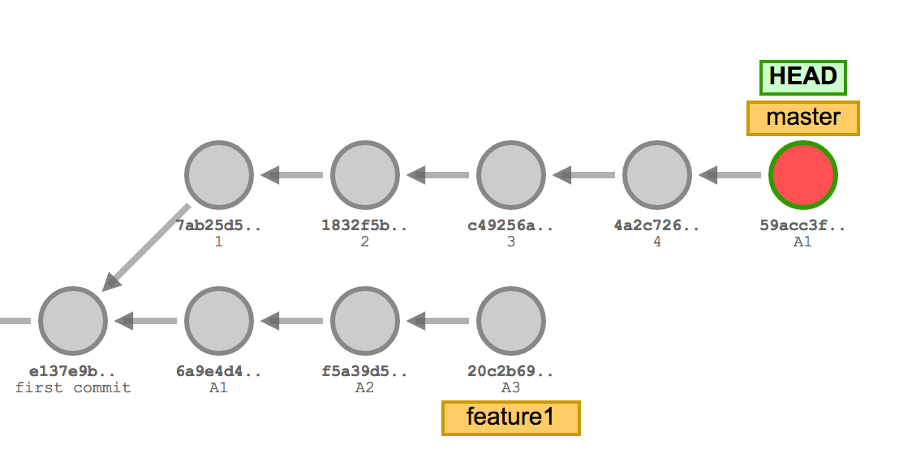

# `cherry-pick` the good stuff only.

Sometimes work on a feature branch may be cancelled and never merged into `master` but we may like to use parts of the code from the branch.

1. Create a new feature `branch`.

2. Make some changes and `commit` your changes. Repeat a few times to add several commits to your branch. 

4. `checkout` the `master` branch.

5. Select a commit from your feature branch and `cherry-pick` it to add it to the master branch.

6. `push` your changes.

7. Optionally delete your local feature `branch`.

8. Go to your Azure devops repository and verify that your changes have been pushed to the `master` branch.
